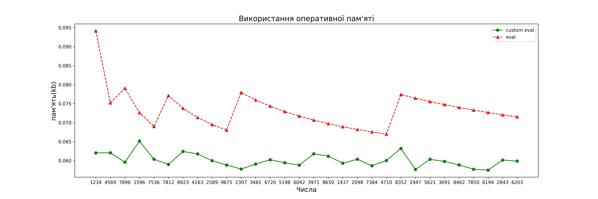
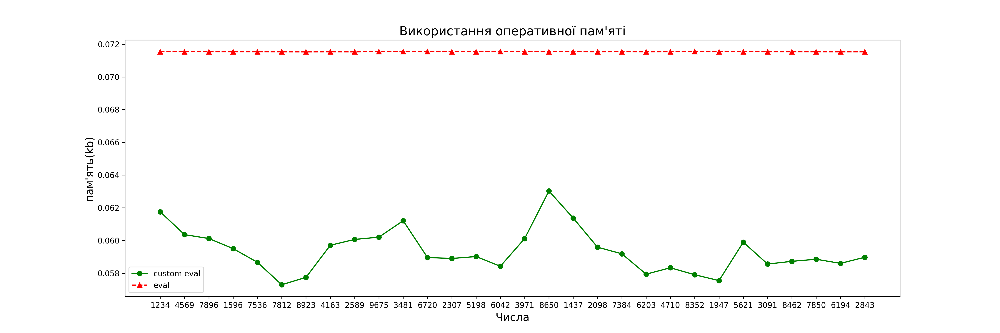
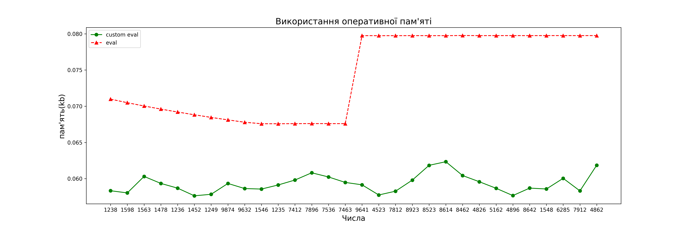
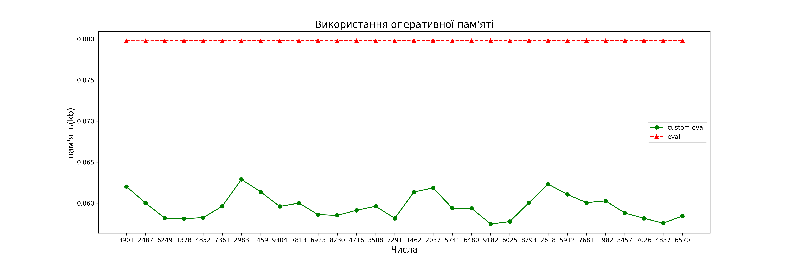

# Math Equation lib

## Короткий опис math equations lib
Math Equations lib - бібліотека для генерації всіх можливих рівностей та перевірки рівностей  з використанням операторів 
**'+', '-', '*', '/', '^', '()'**. Підходить для навчальних задач, тестування алгоритмів, генерації статичних рівностей
для C/pyx. Використовує менше ресурсів процесора, оперативної пам'яті та час виконання порівняно з вбудованою функцією 
'eval' в Python, яка швидко переповнює оперативну пам'ять.

## Структура проєкту
```text
math_equation_lib/
├─math_equations/
│  ├─__init__.py
│  ├─eq.py            # Python eval
│  └─equation_lib.py  # Власна реалізація
├─test/
│  ├─data_cpu/
│  │ ├─custom_eval_generation_eq.csv
│  │ └─python_eval_generation_eq.csv
│  ├─res_test_cpu/
│  │ ├─Енергоспоживання з часом.png
│  │ ├─Завантаження CPU.png
│  │ └─...
│  ├─res_test_ram/
│  │ ├─test_equations_check.png
│  │ ├─test_generation_digits.png
│  │ └─...
│  ├─res_time_speed/
│  │ ├─figure_4.eval.png
│  │ ├─figure_4.numexpr.png
│  │ └─...
│  ├─custom_eval_generation_eq.csv
│  ├─dict_in_for
│  ├─eq.py
│  ├─python_eval_generation_eq.csv
│  ├─test_cpu.py
│  ├─test_ram.py
│  ├─time_speed.py
│  ├─time_test.py
│  └─unittest_equation_lib.py
├─eq_add_sub_br.c
├─eq_mul_div_br.c
├─eq_add_sub_mul_div_br.c
├─levels.h
├─main.c
├─setup_levels.py
├─README_ua.md
└─README.md
```

## Можливості
- Перевірка рівностей
- Генерація **однієї рівності** з заданого числа (довжиною від 4 до 8 цифр)
- Генерація **всіx можливих рівностей** для такої довжини чисел:
    1. 4
    2. 5
    3. 6
    4. 7
    5. 8
- Генерація та **експорт в static data на C/pyx**:
    1. Всі можливі рівності з операторами '+', '-', '()'
    2. Всі можливі рівності з операторами '*', '/', '()'
    3. Всі можливі рівності з операторами '+', '-', '*', '/', '()'

## Приклад перевірки рівності
```python
from math_equations import equation_lib

# Створюємо конфігурацію з максимальною кількістю комбінації
object_config = equation_lib.EquationConfig(15200)

# Створюємо об'єкт для генерації та перевірки рівностей
object_ev = equation_lib.EvalEquation(object_config)

# Повертає True, якщо рівність правильна. False, якщо рівність неправильна 
print(object_ev.is_valid_equation('(3+4)*1=9-2')) # ->  True
print(object_ev.is_valid_equation('(3+4)*1=9+2')) # ->  False
```

## Приклад використання Генерації однієї рівності
```python
from math_equations import equation_lib

# Створюємо конфігурацію з максимальною кількістю комбінації
object_config = equation_lib.EquationConfig(15200)

# Створюємо об'єкт для генерації та перевірки рівностей
object_ev = equation_lib.EvalEquation(object_config)

# Повертає першу знайдену математичну рівність
print(object_ev.process_equation_one('1234')) # оператори '+', '-', '*', '/', '^', '()'
```

## Приклад використання Генерації всіx можливих рівностей
```python
from math_equations import equation_lib

# Створюємо конфігурацію з максимальною кількістю комбінації
object_config = equation_lib.EquationConfig(15200)

# Створюємо об'єкт для генерації та перевірки рівностей
object_ev = equation_lib.EvalEquation(object_config)

# Повертає всі знайдені рівності в межах заданої максимальної комбінації операторів
print(object_ev.process_equation_all_possible('1234')) # оператори '+', '-', '*', '/', '^', '()'
```

## Приклад використання Генерації та експорт в  static data на C/pyx
```python
from math_equations import equation_lib

# Створюємо конфігурацію з максимальною кількістю комбінації
object_config = equation_lib.EquationConfig(15200)

# Створюємо об'єкт для генерації та перевірки рівностей
object_ev = equation_lib.EvalEquation(object_config)

# Генерує всі можливі рівності для 4-значного числа та зберігає у C-файлах
object_ev.equation_add_sub_bracket(4)         # оператори '+', '-', '()'
object_ev.equation_add_sub_bracket(4, False)  # оператори '*', '/', '()'
object_ev.equation_add_sub_mul_div_bracket(4) # оператори '+', '-', '*', '/', '()'
```

## Бібліотека була протестована на Unittest
```bash
python -m unittest discover -s test -p "unittest_*.py"
```

### Unittest охоплюють тести на всі математичні оператори
```python
import unittest
from math_equations import equation_lib

class TestEvalEquation(unittest.TestCase):
    def setUp(self)-> None:
        # Створюємо конфігурацію з максимальною кількістю комбінації
        self.object_config = equation_lib.EquationConfig(500)

        # Створюємо об'єкт для генерації та перевірки рівностей
        self.eq = equation_lib.EvalEquation(self.object_config)

    def test_eval_fast_one(self)-> None:
        self.assertEqual(self.eq._eval_fast('7+5'), 12)
        self.assertEqual(self.eq._eval_fast('3-3'), 0)
        self.assertEqual(self.eq._eval_fast('2*3'), 6)
        self.assertEqual(self.eq._eval_fast('3/3'), 1)
        self.assertEqual(self.eq._eval_fast('3^3'), 27)

    def test_eval_fast_two(self)-> None:
        self.assertEqual(self.eq._eval_fast('-3+3+7'), 7)
        self.assertEqual(self.eq._eval_fast('-7+8'), 1)
        self.assertEqual(self.eq._eval_fast('-1-7+8'), 0)

    def test_eval_fast_three(self)-> None:
        self.assertEqual(self.eq._eval_fast('1--1'), 2)

    def test_eval_fast_four(self)-> None:
        self.assertEqual(self.eq._eval_fast('(3+4)*1'), 7)
        self.assertEqual(self.eq._eval_fast('(3*4)/2'), 6)
        self.assertEqual(self.eq._eval_fast('(3*4)*2'), 24)

    def test_eval_fast_five(self)-> None:
        self.assertEqual(self.eq._eval_fast('(1+8-9-1+2)+5'), 6)
        self.assertEqual(self.eq._eval_fast('(5*9-6+3)*6'), 252)
        self.assertEqual(self.eq._eval_fast('(-1-7+8)'), 0)
        self.assertEqual(self.eq._eval_fast('(1+2)'), 3)
        self.assertEqual(self.eq._eval_fast('-1+5'), 4)

    def test_eval_fast_six(self) -> None:
        self.assertEqual(self.eq._eval_fast('-1-5'), -6)
        self.assertEqual(self.eq._eval_fast('(-1+2)+5'), 6)
        self.assertEqual(self.eq._eval_fast('(1+2)'), 3)
        self.assertEqual(self.eq._eval_fast('1--1+5'), 7)
        self.assertEqual(self.eq._eval_fast('1-(2-3)+3+5'), 10)
        self.assertEqual(self.eq._eval_fast('1+(3-4)+3'), 3)
        self.assertEqual(self.eq._eval_fast('-3*5'), -15)
        self.assertEqual(self.eq._eval_fast('-7-8'), -15)
        self.assertEqual(self.eq._eval_fast('(5*9-6+3)*6'), 252)
        self.assertEqual(self.eq._eval_fast('6+(1+5)+2+4-9'), 9)
        self.assertEqual(self.eq._eval_fast('8-1^(3/4/2)'), 7)
        self.assertEqual(self.eq._eval_fast('8-1^(3^4^2)'), 7)
        self.assertEqual(self.eq._eval_fast('5+3-(9-8)^6'), 7)
        self.assertEqual(self.eq._eval_fast('5+3-(8-9)^3'), 9)
        self.assertEqual(self.eq._eval_fast('2/3*6'), 4)
        self.assertEqual(self.eq._eval_fast('(9-6)^(9-6)'), 27)
        self.assertEqual(self.eq._eval_fast('(8-9)^(9-6)'), -1)
        self.assertEqual(self.eq._eval_fast('(8-9)^(9-5)'), 1)
        self.assertEqual(self.eq._eval_fast('(9-8)^(6-9)'), 1)
```

## Продуктивність

Нижче наведено порівняння використання оперативної пам'яті 'equation_lib'
із наївною реалізацією на Python

### Використання оперативної пам'яті



- При генерації великої кількості рівностей '' займає менше оперативної пам'яті.
- Вбудована функція '' кожного разу компілює рядок у байт-код, що збільшує споживання ресурсів.



- При виклику понад 30 рівностей 'eval' починає значно більше навантажувати пам'ять.



- Спостерігається різький стрибок використання пам'яті у 'eval'
- Це пояснюється додатковими алокаціями Cpython при масових викликах.



- Після стрибка пам'ять стабілізується на новому рівні.
- 'equation_lib' показує стабільніші результати навіть при високому навантаженні.